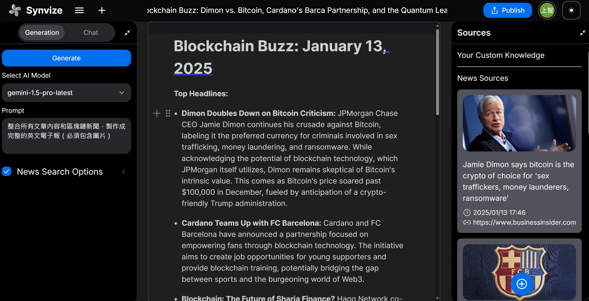

  <a href="README_zh.md">中文版</a> | English

  <h1>👋 Hello, I'm Sun (謝上智)</h1>
  
Software Engineer | AI Developer | Unity Expert

  
  
  
  

## 🚀 About Me
I'm a software engineer at Inventec, focusing on .NET development and AI applications.

- 🎓 Graduate from Shu-Te University, Dept. of Information Engineering
- 💻 2 years .NET + 1 year Unity game development experience
- 🌱 Currently focusing on AI application development
- 🔭 Working on Project Synvize

## 🛠️ Tech Stack

  
  ### Main Skills
  
  
  
  

  ### Other Skills
  
  
  

## 💼 Professional Experience
- 🏢 Software Engineer at Inventec
- 👨‍🏫 University Lecturer for Unity Computer Vision
- 🤝 4 years freelance experience (AR/VR, Computer Vision, AI)
- 📚 Internal sharing on Gemini and Azure OpenAI

## 🚀 Key Projects
### Synvize

  
  

AI-Powered Content Generation Platform
- Automatic data aggregation
- AI-generated articles and newsletters

### Other Projects
- 🎮 Unity Games and Computer Vision Applications
- 🏭 Factory Automation Systems
- 🤖 LINE BOT Applications
- 📊 Python Trading Bots

## 📊 GitHub Stats

  
  

---

  ⭐️ From <a href="https://github.com/SunZhi-Will">SunZhi-Will</a> 