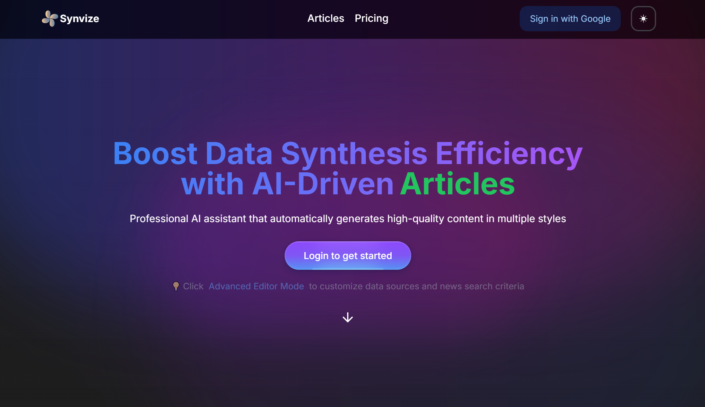
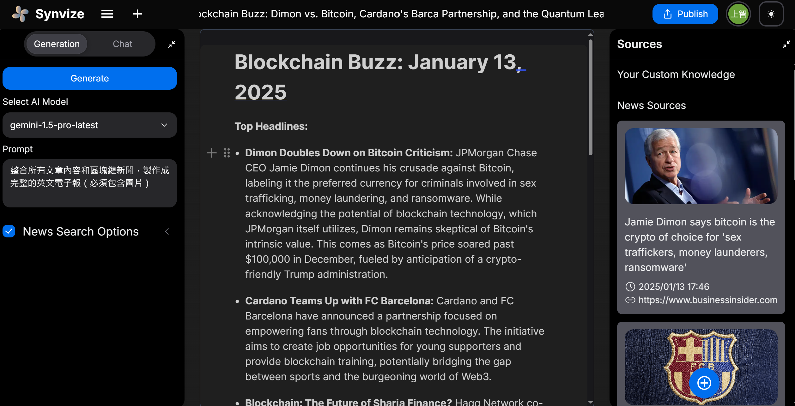

  中文 | <a href="README.md">English</a>

  <h1>👋 你好，我是謝上智 (Sun)</h1>
  
軟體工程師 | AI 開發者 | Unity 專家

  
  
  
  

## 🚀 關於我
我是一名軟體工程師，目前在英業達工作。專注於 .NET 開發，同時也涉足 AI 應用開發領域。

- 🎓 樹德科技大學資訊工程系畢業
- 💻 兩年 .NET 開發 + 一年 Unity 遊戲開發經驗
- 🌱 目前專注於 AI 應用開發
- 🔭 正在開發 Synvize 專案

## 🛠️ 技術棧

  
  ### 主要技能
  
  
  
  

  ### 其他技能
  
  
  

## 💼 專業經驗
- 🏢 英業達軟體工程師
- 👨‍🏫 大學 Unity 影像辨識課程講師
- 🤝 四年接案經驗 (AR/VR、影像辨識、AI)
- 📚 公司內部 Gemini 和 Azure OpenAI 技術分享

## �� 主要專案
### Synvize

  
  

AI 驅動的內容生成平台
- 自動彙整資料
- AI 生成文章和電子報

### 其他項目
- 🎮 Unity 遊戲與影像辨識應用
- 🏭 工廠自動化系統
- 🤖 LINE BOT 應用
- 📊 Python 交易機器人

## 📊 GitHub 統計

  
  

---

  ⭐️ From <a href="https://github.com/SunZhi-Will">SunZhi-Will</a>

 